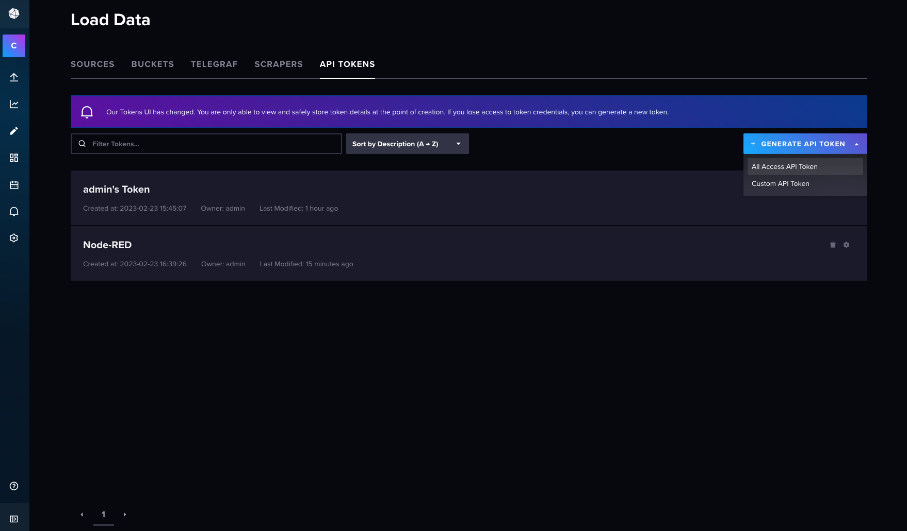
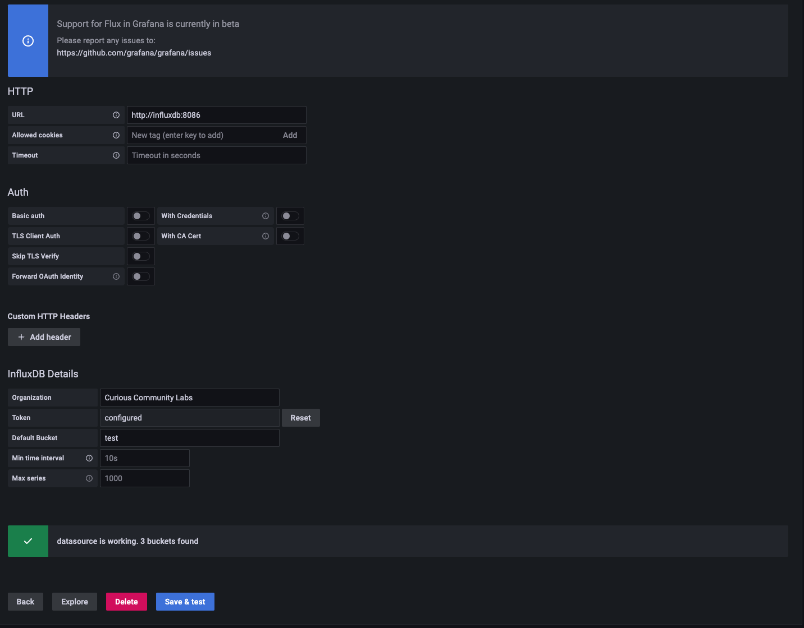
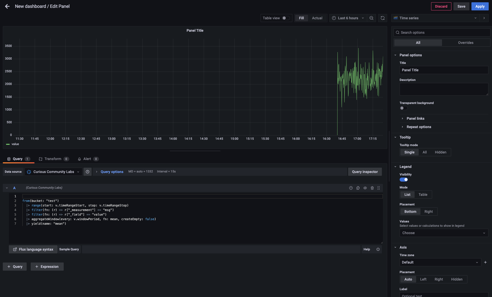

# Grafana general introduction

Grafana is an open source analytics and interactive visualization tool. It provides charts, graphs, and alerts for the web when connected to supported data sources. 

As a visualization tool, Grafana is a popular component in monitoring stacks, often used in combination with time series databases such as InfluxDB.

## Connection

To connect Grafana to our Influx-DB, you have to create a data source.

The `URL`of our InfluxDB is `http://influxdb:8086`. 

In InfluxDB you have to create a `token` to connect: [Load Data -> API Tokens](http://localhost:8086/orgs/721027680173bf2f/load-data/tokens).



You can use this token to [create a connection from Grafana to Influx-DB](http://localhost:3000/datasources/).



After having a connection to a database you can easily create an own dashboard in Grafana.

Here's the demo snippet (directly copyied from Influx Data Explorer) and the screen shot.

```
from(bucket: "test")
  |> range(start: v.timeRangeStart, stop: v.timeRangeStop)
  |> filter(fn: (r) => r["_measurement"] == "msg")
  |> filter(fn: (r) => r["_field"] == "value")
  |> aggregateWindow(every: v.windowPeriod, fn: mean, createEmpty: false)
  |> yield(name: "mean")
```



## example - CSV Import

See [CSV Import](./docs/csv-import.md).

# Grafana LAUDS Gateway configuration

In the following steps we will describe the confgiration steps to adapt the [template dashboard](https://github.com/new-production-institute/lauds-iot-backend/blob/template/software/dashboard/dashboards/Fleet%20Operations%20%26%20Machine-1760085326658.json) to a local LAUDS setup. As device example we use a machine with linked energy parameters.

## Connecting to data source
- Go to configurations(settings) -> Data sources and click on add data source.
- Select ```InfluxDB```
- Select the query language as ```Flux```
- Enter url of the Influxdb, username and password, organization,token and bucket name.
- Click on save and test to check the connection.
- 
- 

## Dashboard quey updates.
- Go to Dashboards -> Browse -> Fleet Operation and Machine dashboard.
- For each pannel select edit option and select the data source as influxdb or which name you provided while connecting the DB.
- 

## Dashboard Variables
- Selct the settings from the top left of the dashboard.
- Go to variables 
- Select the variable and change the data source with the name of your data source.
- 
